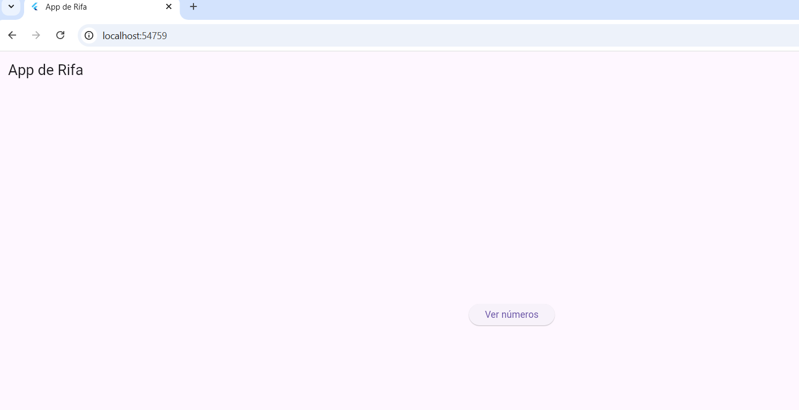
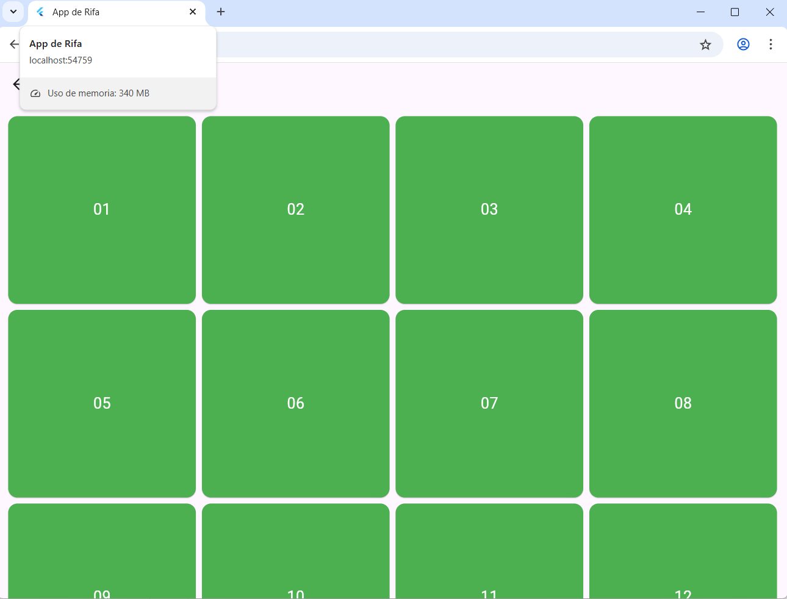
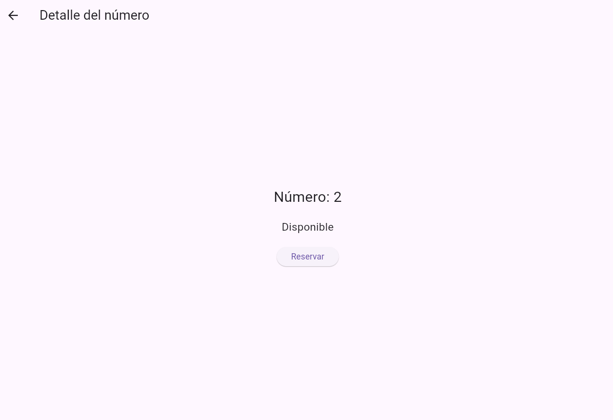
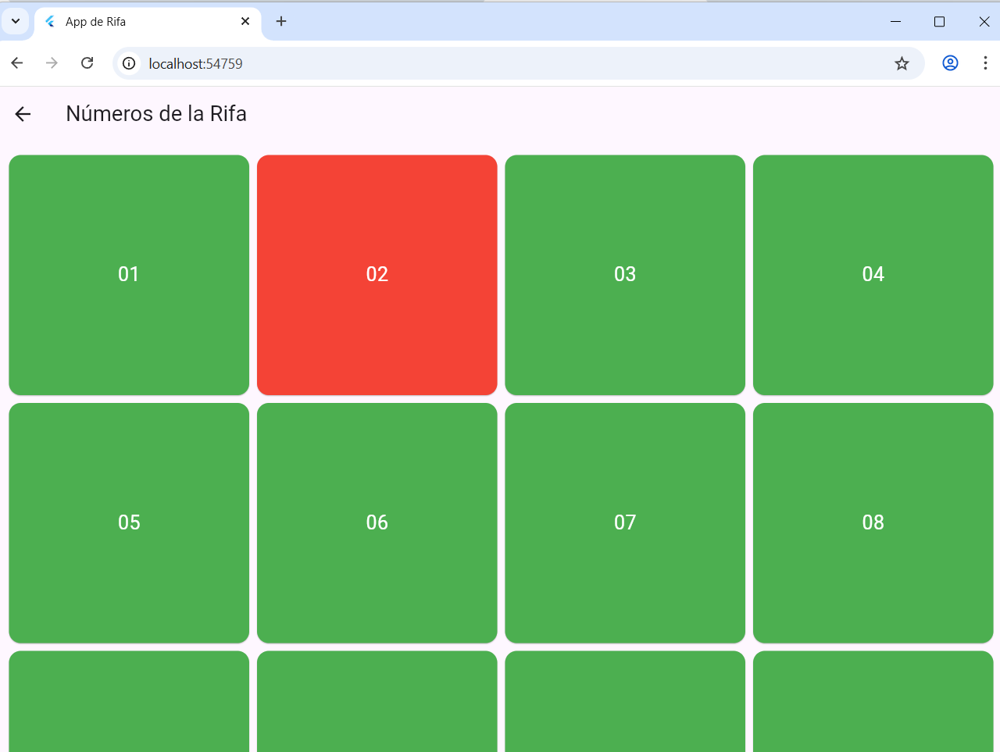

# App de Rifa Flutter

Aplicación móvil desarrollada en Flutter que permite seleccionar y reservar números de una rifa.

## Funcionalidades
- Lista de 20 números
- Estado disponible / reservado
- Navegación entre pantallas
- Simulación de reserva

## Pantallas
- Home
- Lista de números
- Detalle del número
- ## Capturas de pantalla

### Pantalla principal

### Lista de números

### Detalle del número

### Reserva

## Autor
Jordi Coello
